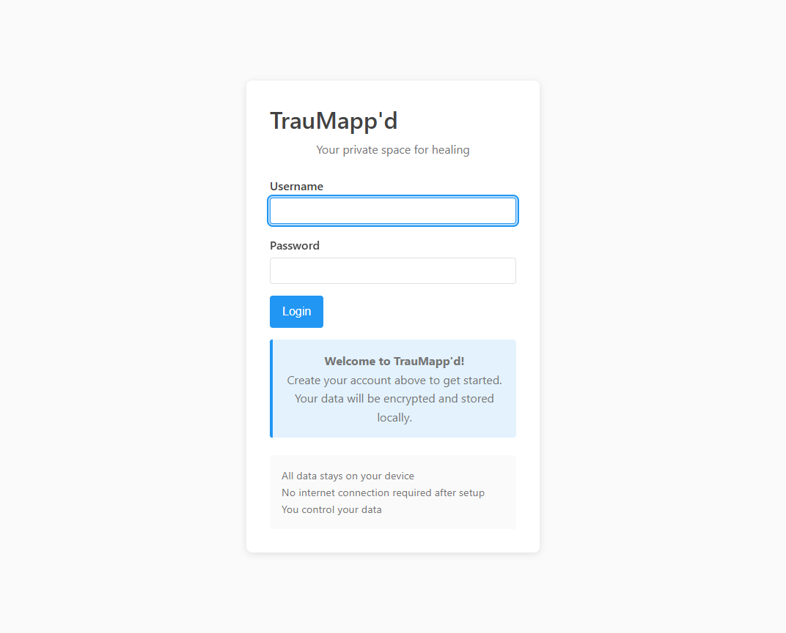
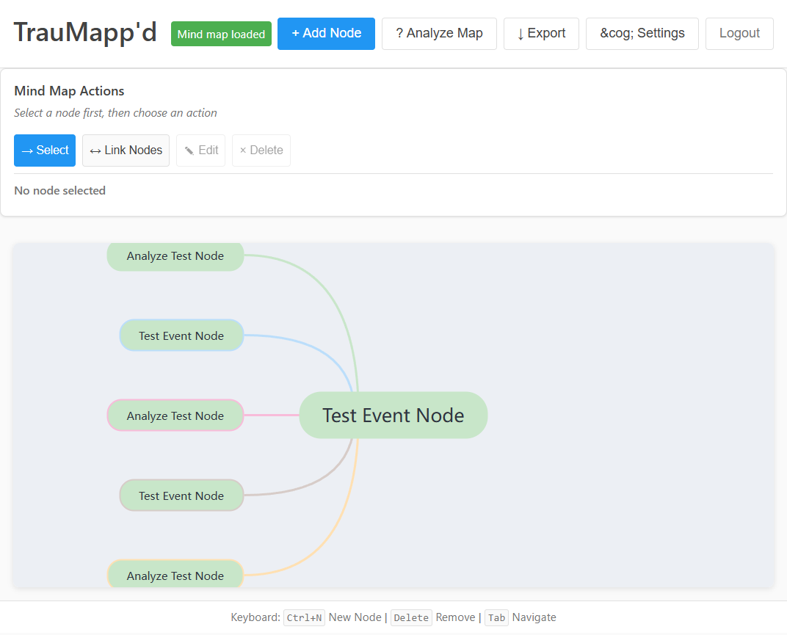

# TrauMapp'd — Positioning & Messaging

> **Working name.** "TrauMapp'd" is provisional pending brand/name research (existence, trademark, app-store/domain collisions, and audience resonance). See the open research; alternatives and a recommendation will land here.

> **Marketing guardrails (non-negotiable).** This is a **self-help / wellness** tool, **not therapy or a medical device**. No claims of treating, diagnosing, or curing trauma/PTSD. No outcome promises. Language stays gentle, validating, and non-triggering. Privacy claims must be literally true (they are: local-first; sync is end-to-end encrypted / zero-knowledge).

---

## One-liner

**A private, gentle space to map your trauma — and see your own healing take shape.**

## Elevator pitches

**15 seconds.**
TrauMapp'd is a privacy-first app for mapping trauma experiences as a visual mind map. Everything stays on your device, encrypted; you own your story. It's the calm, safe middle ground between a journal and a whiteboard — built with trauma-informed design.

**30 seconds.**
Survivors are often told to "connect the dots" — between triggers, emotions, people, and coping — but there's no safe, private tool to actually *see* those connections. TrauMapp'd lets you map your experiences as an interactive mind map: events, emotions, triggers, coping, growth, and how they relate. It's local-first and end-to-end encrypted, so your most sensitive reflections never leave your control. Free on your own device; pay only if you want encrypted sync across your phone, desktop, and the web.

**60 seconds.**
Healing from trauma is rarely linear, and the tools people reach for don't fit. Journals are a wall of text. Generic mind-mappers aren't safe or gentle. Mental-health apps often harvest the most intimate data imaginable. TrauMapp'd is different: a trauma-informed, privacy-first tool for *mapping* your experience — laying out events, emotions, people, places, triggers, coping strategies, insights, and growth as a living map you can rearrange and connect. It's designed to feel calm and predictable: soft colors, gentle language, no jarring motion, crisis resources always within reach. Your data is local-first and encrypted with a key only you hold; even our optional paid cloud sync is zero-knowledge, so we literally cannot read your map. Later, an optional **on-device** AI can gently help you notice patterns — never sending a word of your story to anyone. It's the tool we wished existed: yours, private, and quietly empowering.

---

## The problem

- Trauma processing is **nonlinear and relational**, but common tools are linear (journals) or unsafe/clinical (generic apps).
- The data is **maximally sensitive**, yet most apps are cloud-by-default and monetize data.
- People in distress need **predictable, gentle, accessible** software — most isn't.

## The solution

A **mapping-first**, trauma-informed canvas where experiences become nodes and the relationships between them become visible — backed by genuine privacy (local-first + zero-knowledge sync) and, optionally, a **private** AI companion.

## Who it's for

- **Primary:** adults doing self-directed healing/reflection, often alongside therapy.
- **Secondary:** therapists/coaches who want to *recommend* a private tool clients control (we never see the data).
- **Tertiary:** privacy-conscious journalers who want structure over prose.

## Why now

- Rising demand for mental-health self-tools + rising distrust of data-harvesting apps.
- **On-device AI** is now feasible, enabling a privacy-preserving assistant with near-zero marginal cost.
- Local-first + E2E-encrypted sync is a proven, low-overhead architecture.

## Differentiation (positioning pillars)

1. **Mapping, not journaling** — see relationships, not just text.
2. **Genuinely private** — local-first; zero-knowledge sync; optional *on-device* AI. The privacy story and the architecture are the same thing.
3. **Trauma-informed by design** — gentle language, soft visuals, predictable UI, crisis resources, accessibility as architecture.
4. **You own it** — your data, your device, exportable, no lock-in. Free locally; pay only for convenience (sync), never for access to your own story.

## Monetization (low overhead)

- **Free forever, local-first** on desktop & web (and mobile later).
- **Paid:** optional **encrypted cross-device sync** (desktop ↔ phone ↔ web). Recurring, low-cost; server only stores ciphertext it can't read → low liability + low cost.
- Possible later: one-time desktop license, "supporter" tier, optional private-AI pack.

## Objection handling

- *"Is my data safe?"* → Local-first; encrypted with a key only you hold; sync is zero-knowledge. Open to audit.
- *"Is this therapy?"* → No. It's a reflection tool; we surface crisis resources and encourage professional support.
- *"Could mapping trauma be triggering?"* → Designed to minimize it (gentle pacing, opt-in depth, grounding affordances), and you control everything.
- *"Why pay?"* → The core is free. You pay only for the convenience of secure sync — never to access your own data.

## Provisional taglines (pending name research)

- "See your healing take shape."
- "Your story, mapped — and yours alone."
- "A private map for what you've carried."
- "Make sense of it, safely."

## Visuals

*The login screen — clean and on-brand today.*

*The map view — **current build with placeholder test data and known pre-MVP defects** (e.g. the broken Settings glyph, issue #8). Not marketing-ready yet; milestone M1 hardens structure persistence (#20), canvas theming (#27), and onboarding (#28). Use the login shot for external visuals until M1 lands.*
