# User Story: a first run, and changing your mind

**Scenario.** Someone opens Wymber for the first time, cautious, not sure what to expect. They
create their private space, meet the map through a short walkthrough, lay out two things that
happened, connect them, then change their mind and unlink. Along the way they notice crisis
support is one tap away, and that there's a plain "what's new".

**Persona.** A first-time visitor, hesitant, exploring at their own pace, the way a real person
in a tender moment actually moves: reading, pausing, trying, undoing.

**Build.** `feat/alpha-feedback-batch` (alpha feedback: #107, #117, #118, #119). Recorded
2026-06-06 by driving the live app with Playwright and emulating the behaviour above.

> Replay note: the deterministic version of this lives in `e2e/mindmap.spec.js` (dedupe + unlink,
> the walkthrough, what's-new, crisis links). This document is the human-facing walkthrough with
> screenshots, meant to be re-run and re-shot when the experience changes.

---

### 1. Create a private space
The first screen asks only for a password, the key that encrypts everything on the device. Calm,
no account, no demands.

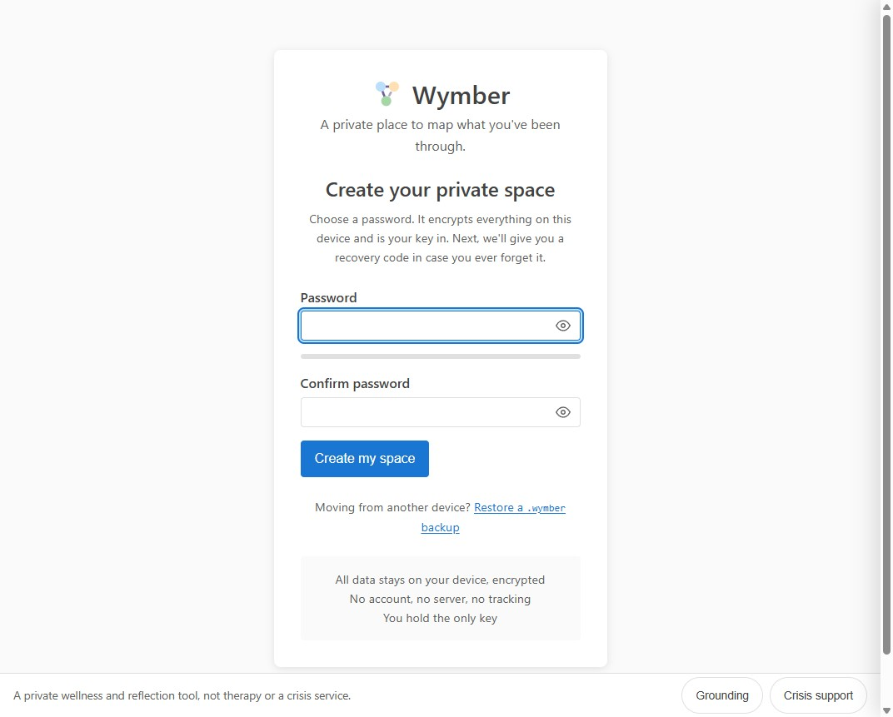

### 2. Save the recovery code
Because there's no server to reset a password, the recovery code is the only way back in. It's
handed over once, with a clear "we can't recover it for you. That's the point."

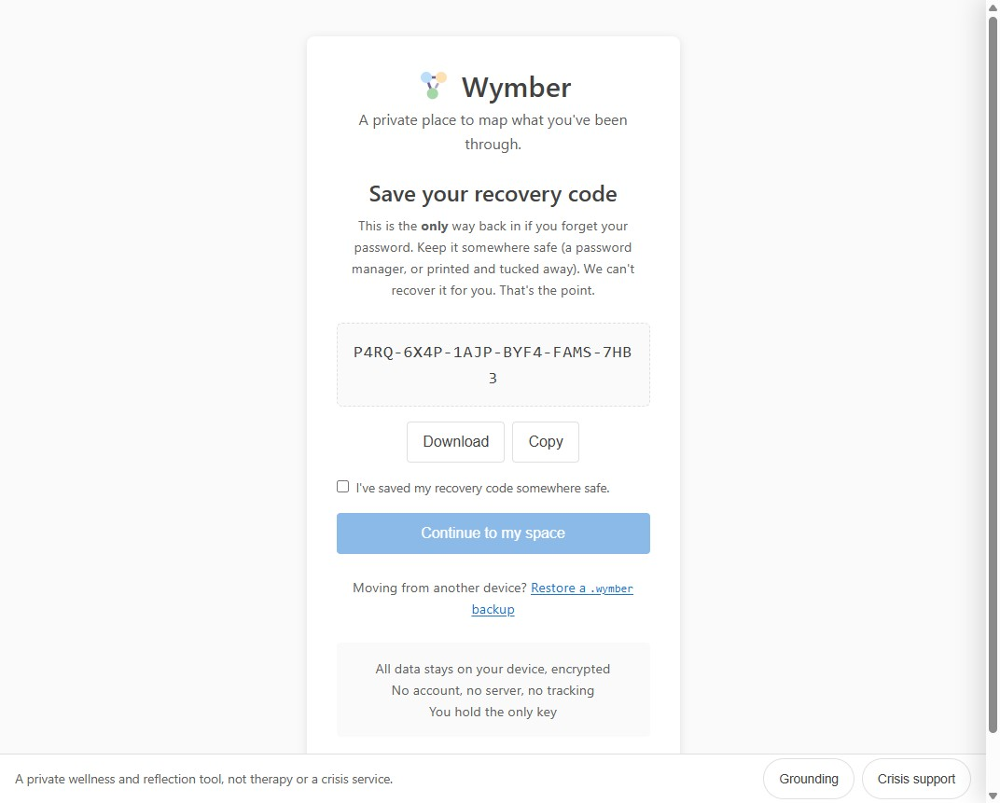

### 3. A soft start
Before the map, a breath. "Your map is here whenever you're ready. You set the pace."

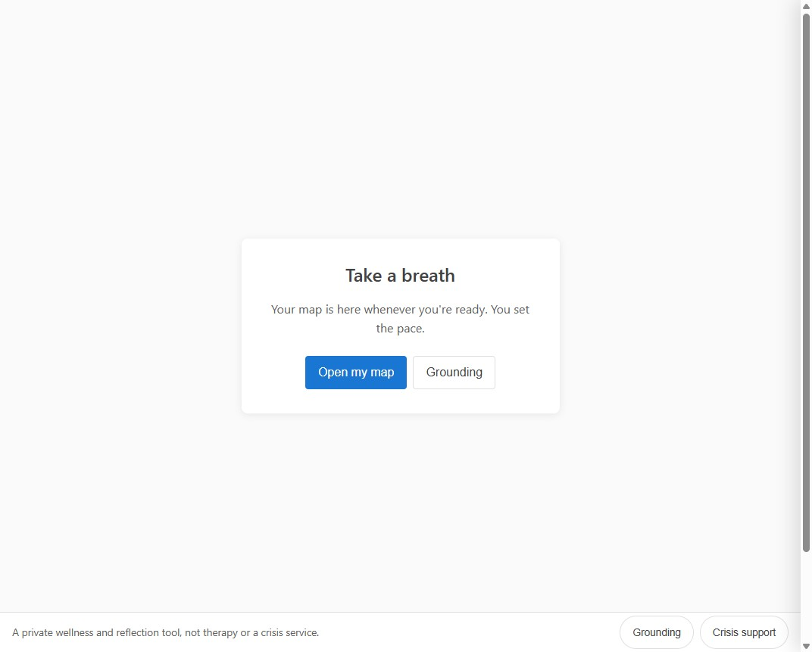

### 4. The walkthrough meets them (#118)
On first run, a short, skippable walkthrough appears over the map: welcome, add, link, unlink, go
gently. Progress dots, Skip, Next, and a "How it works" button in the header to reopen it anytime.

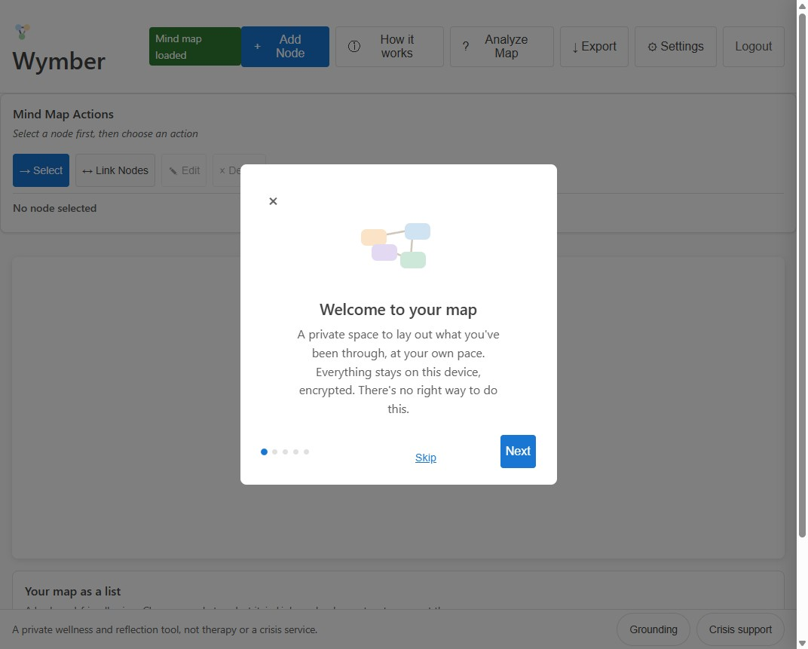

It explicitly teaches that nothing is permanent, that you can unlink and change anything.

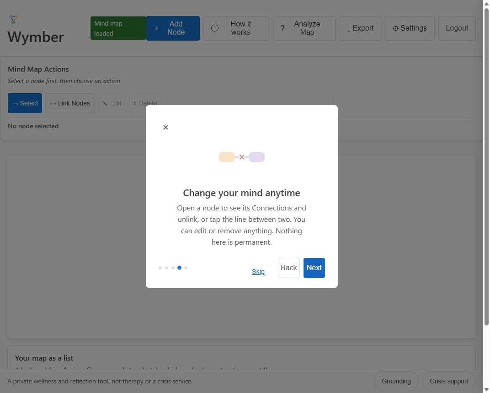

### 5. Lay out two things, and connect them (#117)
They add "The argument" (an event) and "A tight chest" (a body sensation), then use Link Nodes to
connect them. The connection shows on the canvas and in the accessible list twin.

### 6. Linking again is gently refused (#117)
Trying to connect the same two again doesn't stack a duplicate. A quiet note: *"The argument" and
"A tight chest" are already connected.*

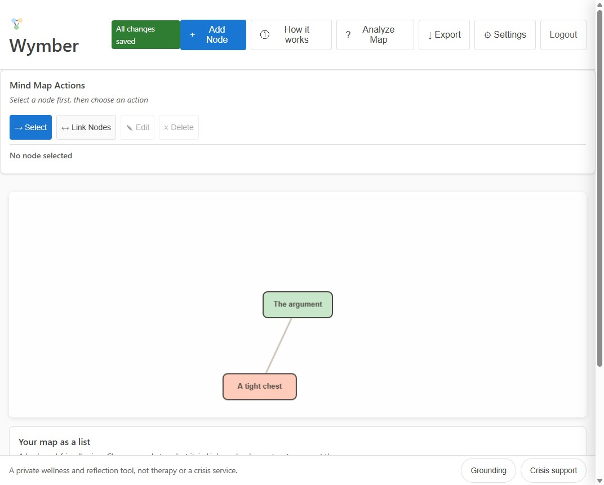

### 7. Changing their mind: unlink (#117)
Selecting a node opens its detail drawer. Its Connections list now carries an **Unlink** control
for each link (and tapping the line on the canvas works too).

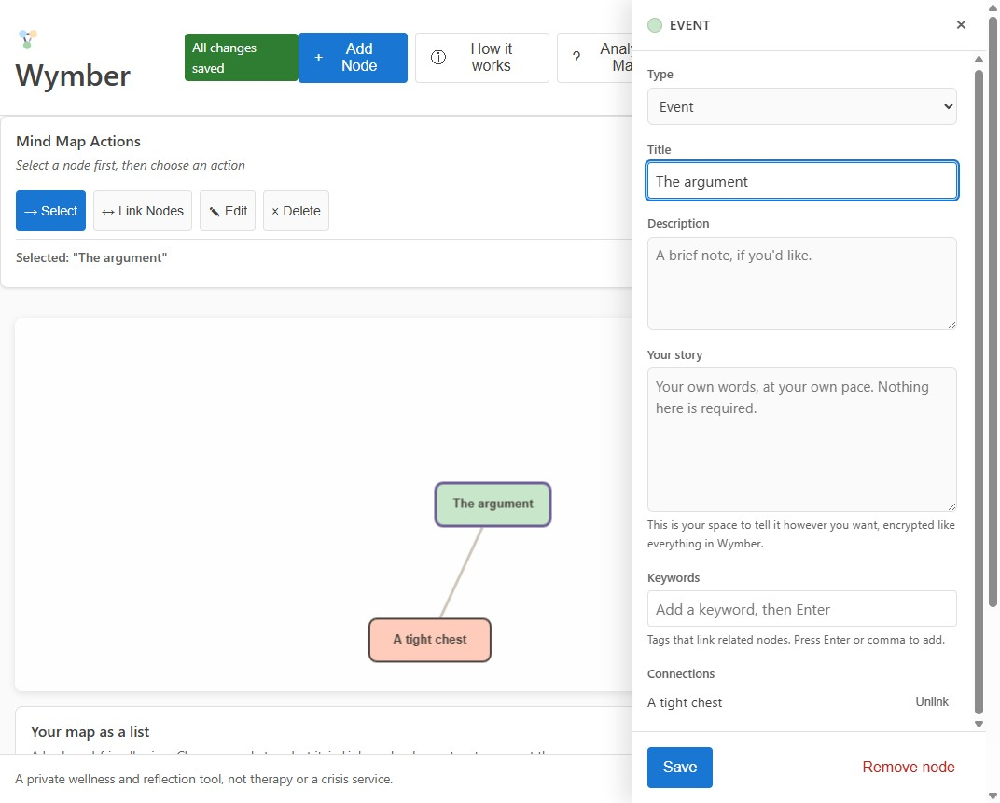

One click and the connection is gone, no scary confirm, because it's reversible. The drawer and the
list update in lockstep.

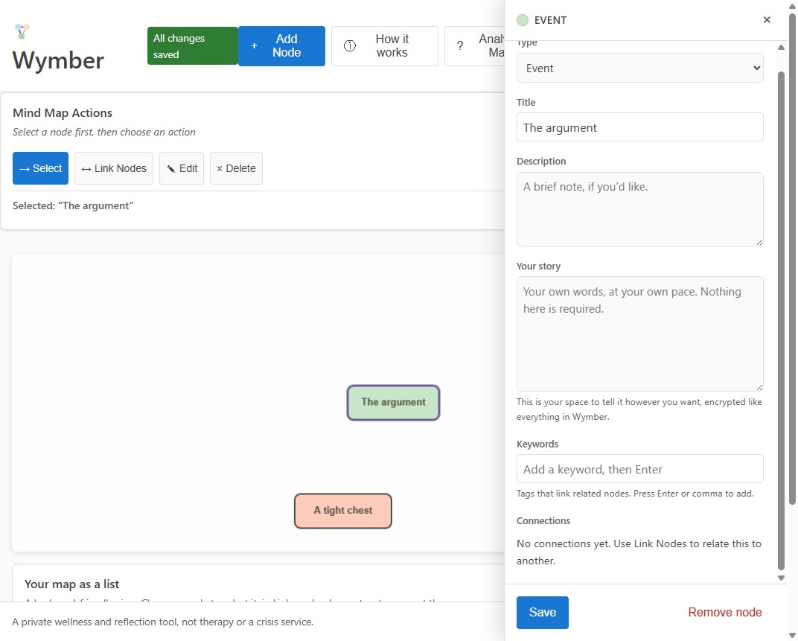

### 8. Crisis support, made real (#107)
Crisis support is always in the bar. The numbers are now actions, grounded in how 988 works (call,
text, or chat): Call 988 / Text 988, Text HOME to 741741, Call 911.

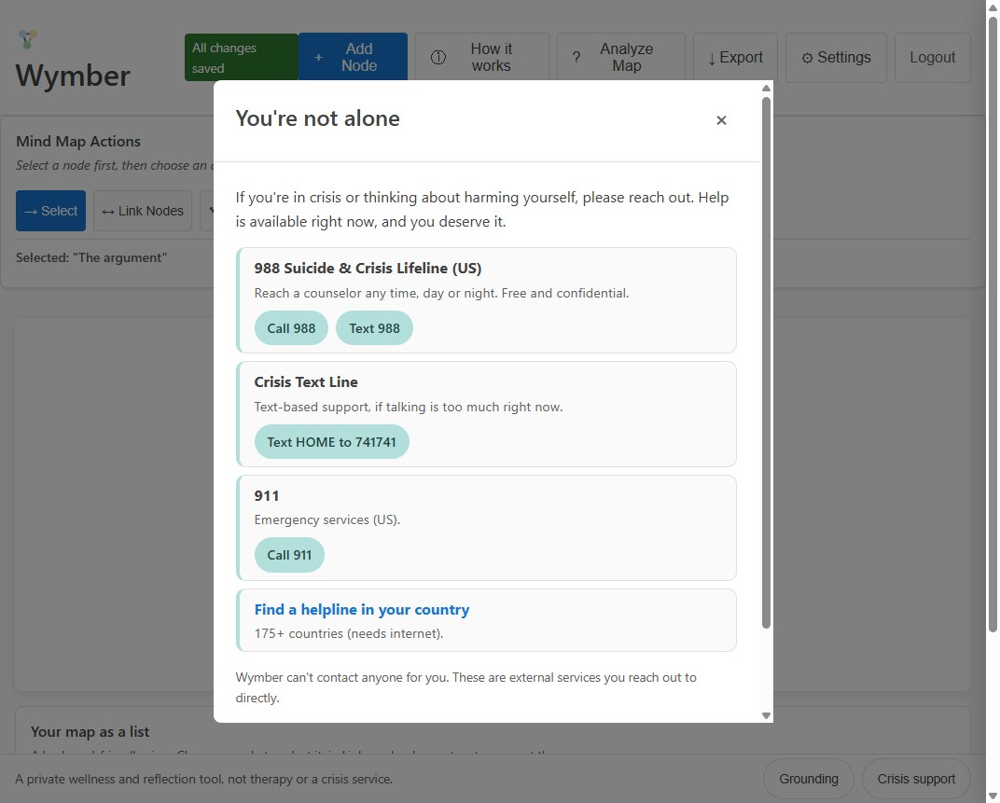

### 9. What's new, not hidden (#119)
A quiet "What's new" in the footer opens a short, human list of recent changes, no digging.

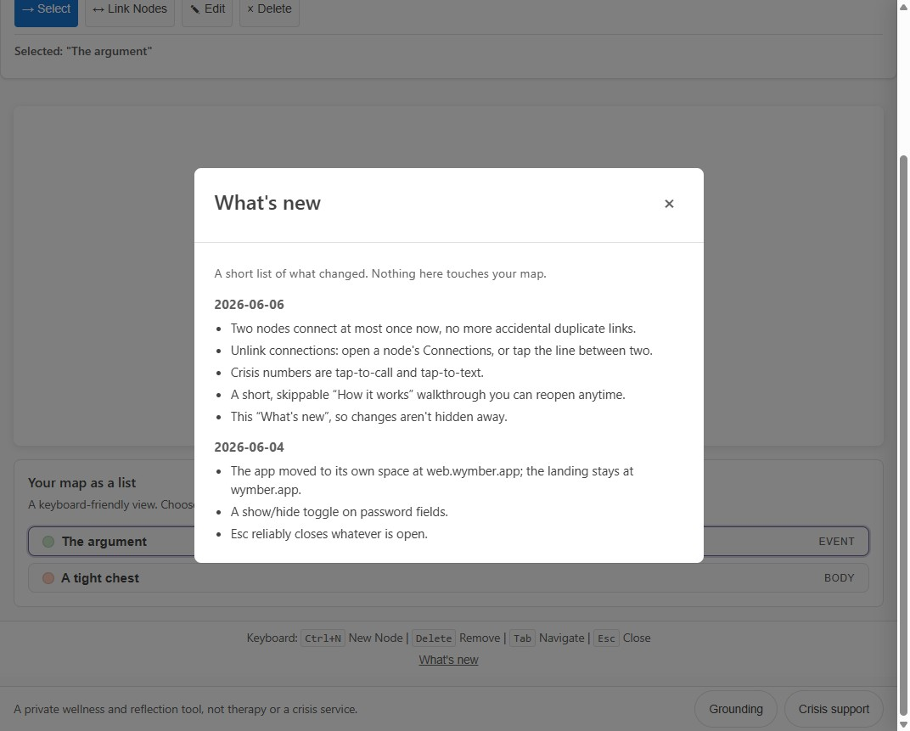

### 10. The landing tells the same story
The landing has a matching, simple changelog page, linked from the footer next to Sources.

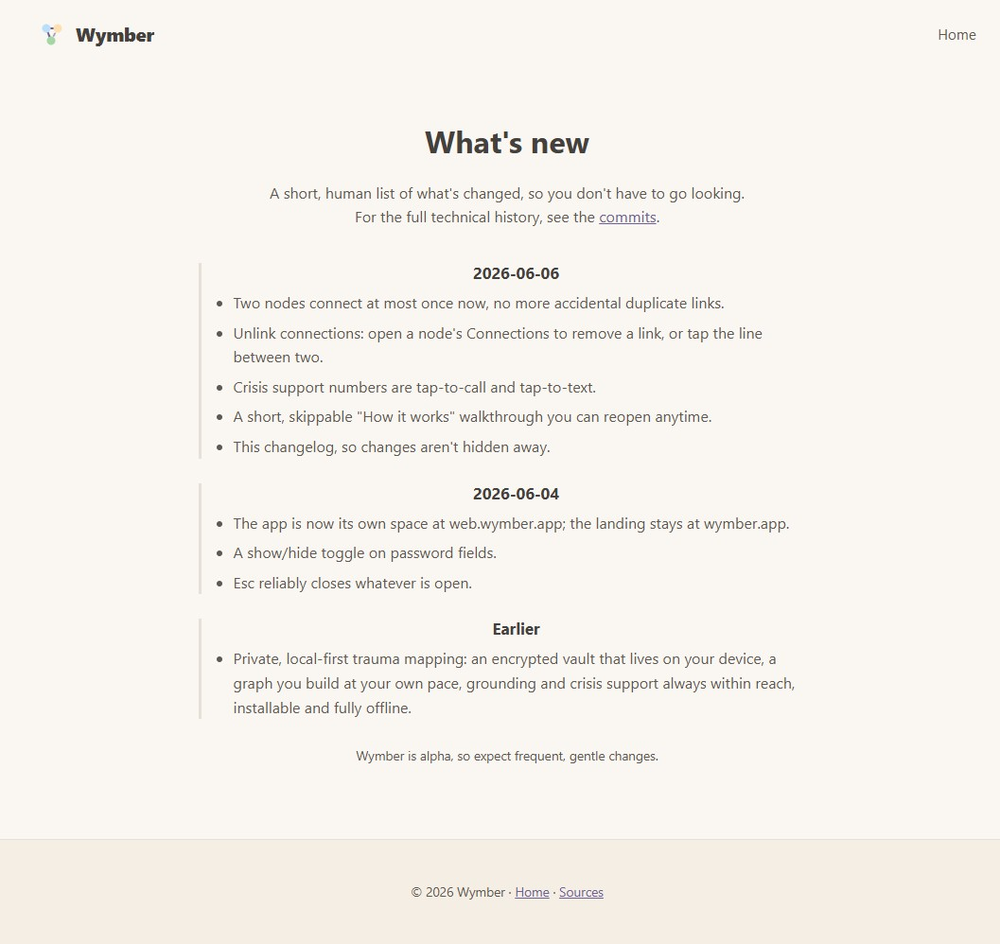

---

**What this story exercises:** edge dedupe + unlink (#117), the first-run walkthrough (#118),
crisis call/text links (#107), the in-app + landing changelog (#119), plus the existing
create → recovery → soft-start → map flow. All steps behaved as intended.
