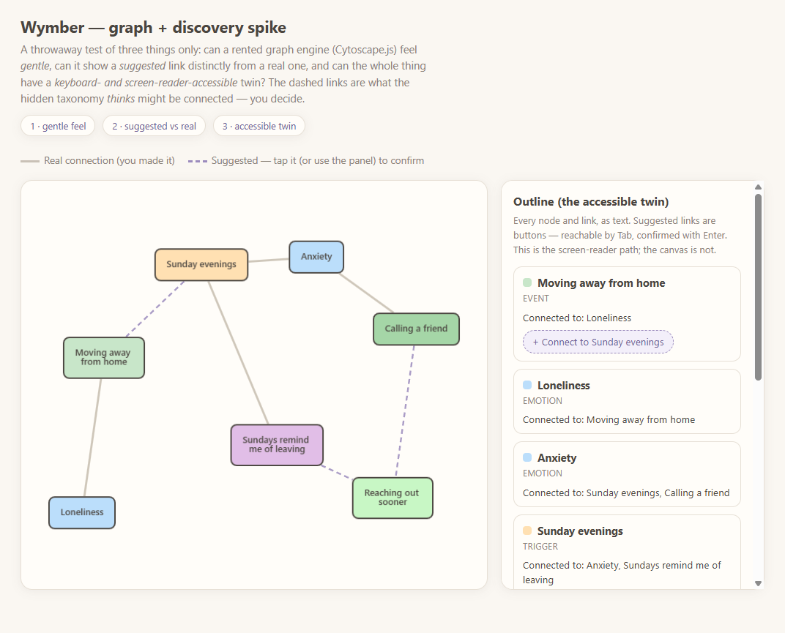
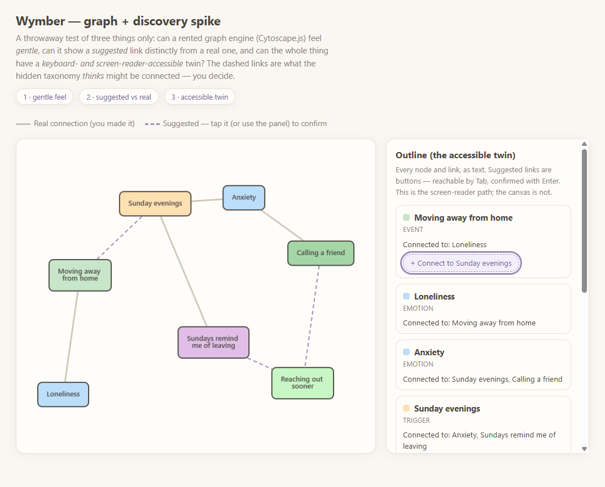
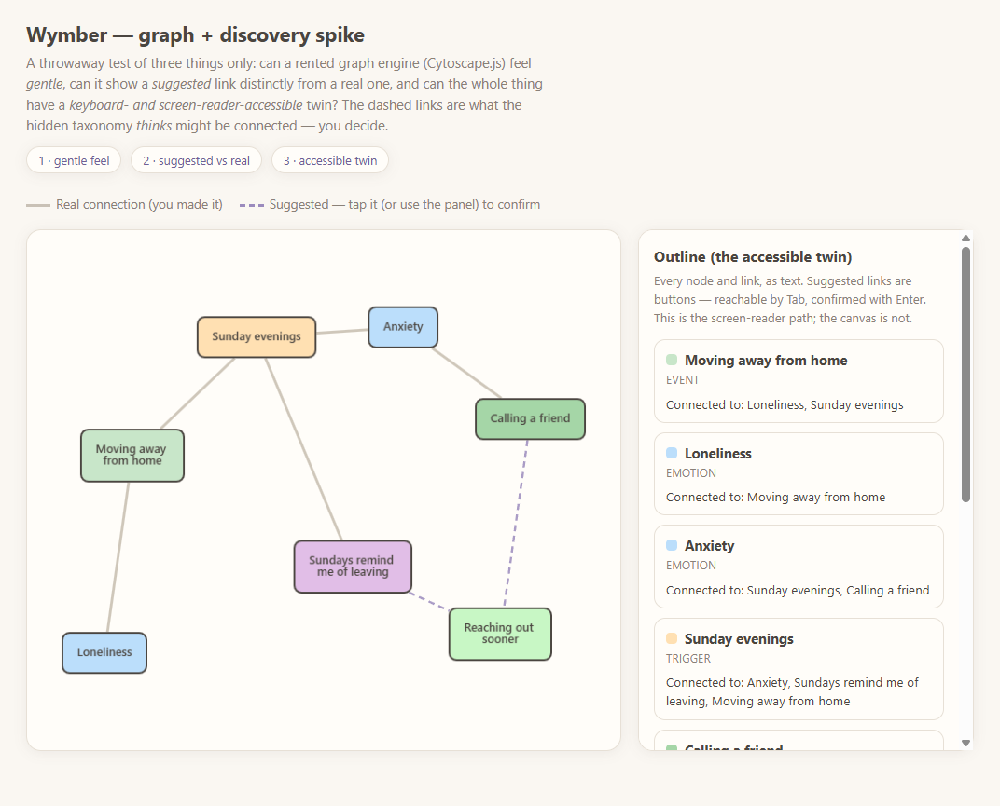

# Spike: graph + discovery (Cytoscape.js)

Throwaway exploration backing **[ADR-0002](../../docs/adr/0002-graph-model-and-discovery.md)**.
It exists to answer three questions and nothing more:

1. **Feel** — can a rented graph engine be skinned to feel *gentle / cute* (soft "building
   blocks"), not a clinical network diagram?
2. **Discovery** — can a *suggested* link (the hidden taxonomy's guess) look distinct from a
   *real* one, and can confirming it promote suggestion → real?
3. **Accessibility** — is there a keyboard- and screen-reader-reachable twin of the canvas?

**Result: yes to all three.** See the findings section of ADR-0002.

## Run it

It is self-contained (Cytoscape is vendored under `vendor/`). Serve the repo root and open the
page — a static file server is enough:

```bash
python -m http.server 8200          # from the repo root
# then open http://localhost:8200/spikes/graph-cytoscape/index.html
```

## What you're looking at

A small, gentle sample map (moving away → loneliness/anxiety → a Sunday-evening trigger →
calling a friend → insight → growth). Solid lines are connections you made; **dashed purple
lines are suggestions** the taxonomy surfaced. Tap a dashed edge — or Tab to a **"+ Connect…"**
button in the Outline panel and press Enter — to confirm it. The graph and the text outline are
two views of the same node/edge model, so they always agree.

## Evidence

| | |
|---|---|
| Initial render — soft blocks, dashed suggestions |  |
| First Tab reaches a suggestion button (focus ring) |  |
| After Enter — suggestion promoted to a real link, both views updated |  |

## Not in scope

Real `suggestLinks()` scoring, the full taxonomy, live data from the vault, layout polish, and
the deprecated `width/height: 'label'` sizing — all deferred to the v2 build per ADR-0002.
